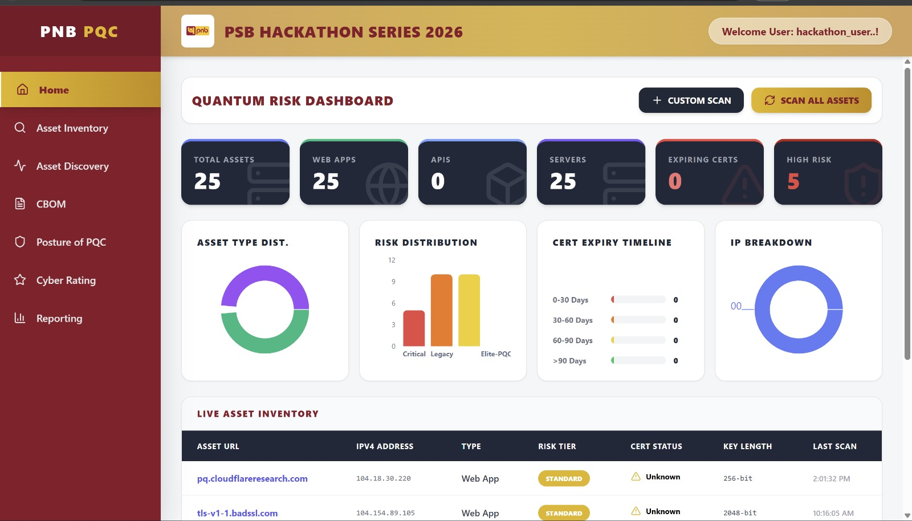
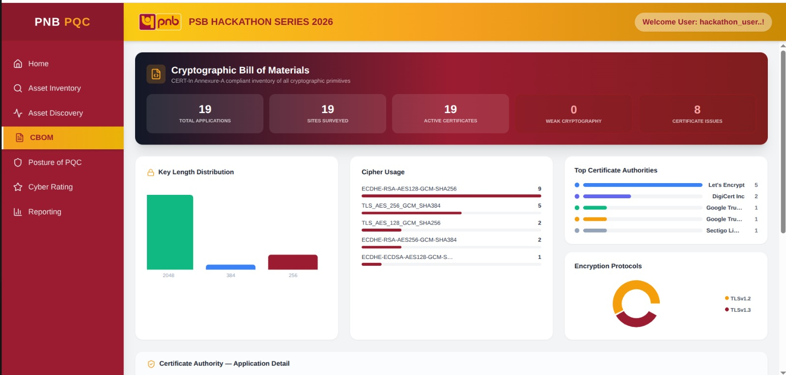
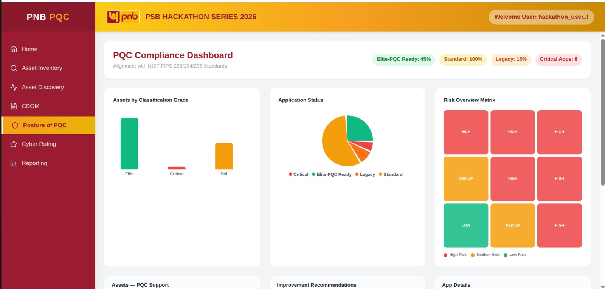
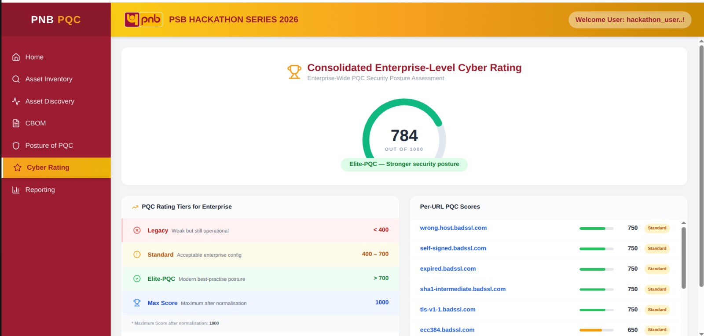
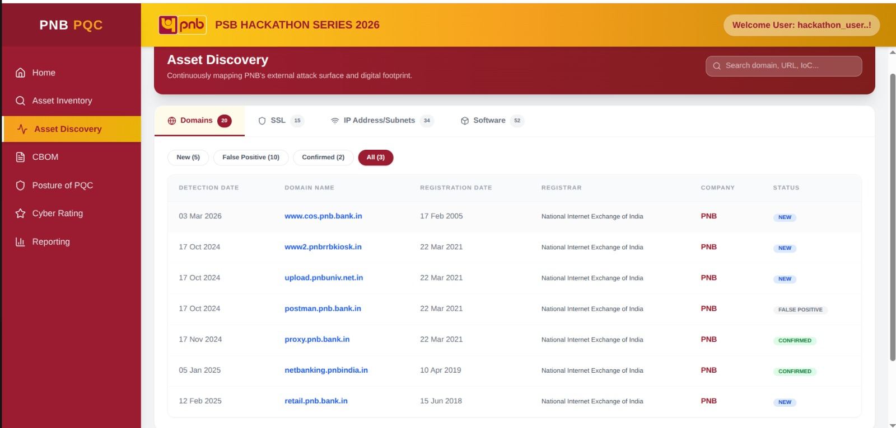
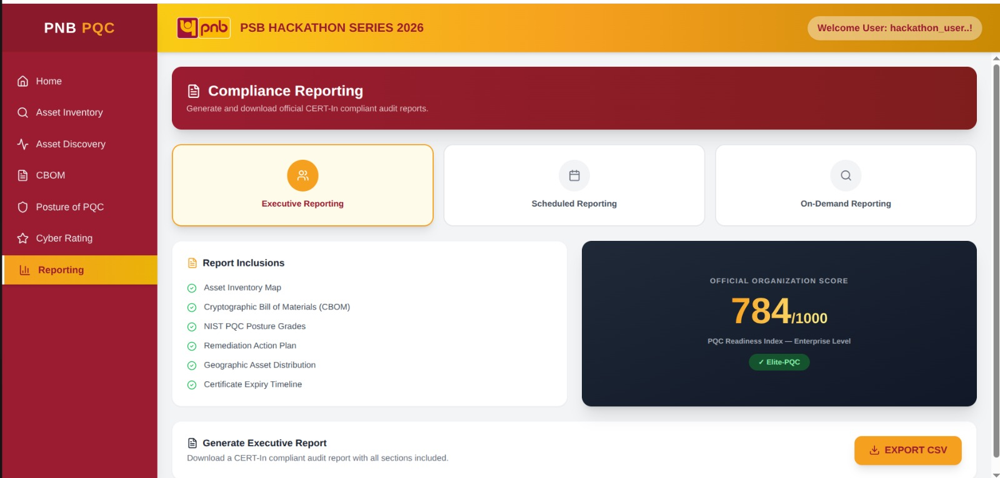

<div align="center">

# 🛡️ PNB PQC — Quantum-Proof Systems Scanner

### PSB Hackathon Series 2026 · In Collaboration with IIT Kanpur

[](https://python.org)
[](https://fastapi.tiangolo.com)
[](https://react.dev)
[](https://sqlite.org)
[](LICENSE)

> **"Quantum-Ready Cybersecurity for Future-Safe Banking"**  
> A full-stack platform to scan, inventory, and assess the Post-Quantum Cryptography (PQC) readiness of Punjab National Bank's public-facing digital infrastructure.


</div>

---

## 📋 Table of Contents

- [Background](#-background)
- [Problem Statement](#-problem-statement)
- [Key Features](#-key-features)
- [Architecture](#-architecture)
- [Tech Stack](#-tech-stack)
- [Project Structure](#-project-structure)
- [Getting Started](#-getting-started)
- [API Reference](#-api-reference)
- [Scoring System](#-scoring-system)
- [Screenshots](#-screenshots)
- [Team](#-team)

---

## 🔍 Background

The rapid evolution of **quantum computing** poses an existential threat to classical cryptography. Adversaries are already executing **"Harvest Now, Decrypt Later" (HNDL)** attacks — intercepting encrypted data today to decrypt it once cryptanalytically relevant quantum computers (CRQCs) emerge.

Banks like Punjab National Bank (PNB) operate hundreds of public-facing assets — web apps, APIs, VPNs, mail servers — all secured by RSA/ECC cryptography that quantum computers can break with Shor's Algorithm.

This platform was built to answer: **"Which of PNB's public assets are quantum-safe, and what needs to be fixed first?"**

---

## 🎯 Problem Statement

> Develop a software scanner to validate deployment of quantum-proof ciphers and create a **Cryptographic Bill of Materials (CBOM)** inventory for public-facing applications (Web Servers, APIs, Systems).

**Required outcomes:**
- 📋 List crypto inventory (TLS Certificates, TLS-based VPN, APIs) exposed to the internet
- 🔐 Identify cryptographic controls: ciphers, key exchange, cipher suites, TLS versions
- ✅ Issue a **"PQC-Ready"** label to assets using NIST-standardized Post-Quantum Algorithms
- ⚠️ Provide actionable remediation recommendations for non-PQC-ready assets

---

## ✨ Key Features

### 🔬 Scanner Engine
- **Python-native TLS scanning** using the built-in `ssl` module — no external binary dependency
- **Full certificate parsing** via the `cryptography` library: key size, algorithm, issuer, validity dates
- **PQC detection** for NIST FIPS 203/204/205 algorithms (ML-KEM/Kyber, ML-DSA/Dilithium, SLH-DSA/SPHINCS+)
- **OpenSSL secondary pass** for key exchange group detection (X25519Kyber768, etc.)
- **Asset type classification**: Web App, API, VPN, Server, Mail Server

### 📊 Dashboard & Analytics
| Page | What It Shows |
|------|--------------|
| **Home** | 8 live stat cards, risk distribution chart, asset type breakdown, live infrastructure table |
| **Asset Inventory** | Searchable full asset table with crypto health, score, cert status |
| **Asset Discovery** | Tabbed discovery view — Domains, SSL Certs, IP/Subnets, Software with sub-filters |
| **CBOM** | Cryptographic Bill of Materials — key lengths, cipher usage, top CAs, encryption protocols |
| **Posture of PQC** | NIST compliance dashboard — pie chart, risk matrix heatmap, improvement recommendations |
| **Cyber Rating** | Enterprise score (0–1000), tier table, per-URL breakdown |
| **Reporting** | Executive, Scheduled, and On-Demand reporting modes with CSV export |

### 🏆 Risk Tier Classification
| Tier | Score (0–1000) | Description |
|------|---------------|-------------|
| 🟢 **Elite-PQC** | > 700 | NIST PQC algorithms detected — Quantum-Safe label issued |
| 🟡 **Standard** | 400–700 | TLS 1.2/1.3 with strong ciphers — migration recommended |
| 🟠 **Legacy** | 200–399 | Weak protocols or ciphers — remediation required |
| 🔴 **Critical** | 0–199 | Expired/weak certs, SSL v2/v3 — immediate action needed |

---

## 🏗️ Architecture

```
┌─────────────────────────────────────────────────────────────┐
│                     React Frontend (Vite)                    │
│  Home │ Inventory │ Discovery │ CBOM │ Posture │ Rating │ Reports │
└───────────────────────────┬─────────────────────────────────┘
                            │ REST API (Axios)
                            ▼
┌─────────────────────────────────────────────────────────────┐
│                  FastAPI Backend (Python)                     │
│                                                              │
│   /api/scan          /api/scan-all      /api/discover-pnb   │
│   /api/dashboard     /api/cbom-dashboard                    │
│   /api/pqc-compliance  /api/export/all  /api/scan/{id}      │
└──────────┬────────────────┬────────────────┬────────────────┘
           │                │                │
    ┌──────▼──────┐  ┌──────▼──────┐  ┌─────▼──────┐
    │  scanner.py  │  │evaluator.py │  │database.py │
    │              │  │             │  │            │
    │ Python ssl   │  │ Scoring     │  │ SQLite +   │
    │ + cryptography│ │ Engine      │  │ SQLAlchemy │
    │ + OpenSSL(2°)│  │ (0–10 pts)  │  │            │
    └─────────────┘  └─────────────┘  └────────────┘
```

---

## 🛠️ Tech Stack

### Backend
| Technology | Purpose |
|-----------|---------|
| **Python 3.11+** | Core language |
| **FastAPI** | REST API framework with auto-docs |
| **SQLAlchemy** | ORM for database operations |
| **SQLite** | Lightweight embedded database |
| **cryptography** | Deep X.509 certificate parsing |
| **ssl (stdlib)** | TLS handshake and cipher negotiation |
| **asyncio** | Concurrent scanning in seed script |

### Frontend
| Technology | Purpose |
|-----------|---------|
| **React 18** | UI framework |
| **Vite** | Build tool |
| **Tailwind CSS** | Utility-first styling |
| **Framer Motion** | Page transitions and animations |
| **Recharts** | Bar charts, pie charts, gauges |
| **React Router** | Client-side routing |
| **Axios** | HTTP client for API calls |
| **Lucide React** | Icon library |

---

## 📁 Project Structure

```
pnb-pqc/
│
├── backend/
│   ├── main.py           # FastAPI app — all API routes
│   ├── scanner.py        # TLS scanner (ssl + cryptography + openssl)
│   ├── evaluator.py      # Risk scoring engine (0–10 → 0–1000)
│   ├── database.py       # SQLAlchemy models + auto-migration
│   ├── seed.py           # Database population script
│   └── requirements.txt  # Python dependencies
│
├── frontend/
│   └── src/
│       ├── App.jsx              # Router setup
│       ├── services/
│       │   └── api.js           # Axios API client
│       ├── components/
│       │   ├── Layout.jsx       # Sidebar + header shell
│       │   └── ScanModal.jsx    # Custom target scan modal
│       └── pages/
│           ├── Home.jsx         # Main dashboard
│           ├── AssetInventory.jsx
│           ├── AssetDiscovery.jsx
│           ├── Cbom.jsx
│           ├── PqcPosture.jsx
│           ├── CyberRating.jsx
│           └── Reporting.jsx
│
└── README.md
```

---

## 🚀 Getting Started

### Prerequisites

- Python 3.11+
- Node.js 18+
- OpenSSL (optional — used as secondary scanner for key exchange detection)

---

### Backend Setup

```bash
# 1. Clone the repository
git clone https://github.com/yourusername/pnb-pqc.git
cd pnb-pqc/backend

# 2. Create and activate a virtual environment
python3 -m venv venv
source venv/bin/activate        # Linux/macOS
venv\Scripts\activate           # Windows

# 3. Install dependencies
pip install -r requirements.txt

# 4. Populate the database with live scan data
python seed.py

# 5. Start the API server
uvicorn main:app --reload --host 0.0.0.0 --port 8000
```

The API will be available at `http://localhost:8000`  
Interactive docs: `http://localhost:8000/docs`

---

### Frontend Setup

```bash
# In a new terminal
cd pnb-pqc/frontend

# Install dependencies
npm install

# Start the dev server
npm run dev
```

The app will be available at `http://localhost:5173`

---

### Quick Demo (seed + run)

```bash
# Terminal 1 — Backend
cd backend && pip install -r requirements.txt && python seed.py && uvicorn main:app --reload

# Terminal 2 — Frontend
cd frontend && npm install && npm run dev
```

---

## 📡 API Reference

| Method | Endpoint | Description |
|--------|----------|-------------|
| `GET` | `/` | Health check |
| `POST` | `/api/scan` | Scan a single target URL |
| `POST` | `/api/scan-all` | Bulk scan all PNB assets |
| `POST` | `/api/discover-pnb` | Auto-discover & scan pnbindia.in subdomains |
| `GET` | `/api/dashboard` | Home dashboard stats |
| `GET` | `/api/cbom-dashboard` | CBOM charts and data |
| `GET` | `/api/pqc-compliance` | PQC posture and compliance stats |
| `GET` | `/api/export/all` | All scans for export + cyber rating |
| `DELETE` | `/api/scan/{id}` | Delete a scan record |

### Example: Scan a target

```bash
curl -X POST http://localhost:8000/api/scan \
  -H "Content-Type: application/json" \
  -d '{"target_url": "pnbindia.in"}'
```

```json
{
  "message": "Scan complete",
  "data": {
    "id": 1,
    "target_url": "pnbindia.in",
    "ip_address": "49.50.72.206",
    "tls_version": "TLSv1.3",
    "cipher_suite": "TLS_AES_256_GCM_SHA384",
    "key_size": 2048,
    "public_key_algo": "RSA",
    "risk_tier": "Standard",
    "simple_score": 6.5,
    "risk_score": 650,
    "is_pqc": false,
    "cert_status": "Valid",
    "asset_type": "Web App",
    "recommendations": [
      "Upgrade RSA key to 3072-bit+ for post-quantum resilience.",
      "Implement ML-KEM (FIPS 203) for key encapsulation.",
      "Consider hybrid PQC+classical (X25519+Kyber768) during migration."
    ]
  }
}
```

---

## 📐 Scoring System

The scoring engine evaluates each asset across 4 dimensions:

```
┌─────────────────────────────────────────────────────┐
│              PQC Scoring Rubric (0–10)               │
├──────────────────────┬──────────────┬───────────────┤
│ Dimension            │ Max Points   │ Criteria      │
├──────────────────────┼──────────────┼───────────────┤
│ TLS Version          │ 4.0 pts      │ TLS 1.3 = 4.0 │
│                      │              │ TLS 1.2 = 2.5 │
│                      │              │ TLS 1.1 = 1.0 │
│                      │              │ TLS 1.0 = 0.5 │
├──────────────────────┼──────────────┼───────────────┤
│ Cipher Suite         │ 3.0 pts      │ ECDHE-AES-GCM │
│                      │              │ = 3.0 (strong)│
│                      │              │ Weak = 0.0    │
├──────────────────────┼──────────────┼───────────────┤
│ Key Size             │ 2.0 pts      │ ≥4096 = 2.0   │
│                      │              │ ≥3072 = 1.5   │
│                      │              │ ≥2048 = 1.0   │
│                      │              │ <1024 = 0.0   │
├──────────────────────┼──────────────┼───────────────┤
│ Forward Secrecy      │ 1.0 pt       │ ECDHE/DHE     │
└──────────────────────┴──────────────┴───────────────┘

PQC Detected → Instant Elite-PQC | Score: 10.0 / 1000
risk_score (0–1000) = simple_score × 100
```

---

## 📸 Screenshots

| Dashboard | CBOM |
|-----------|------|
|  |  |

| PQC Posture | Cyber Rating |
|-------------|-------------|
|  |  |

| Asset Discovery | Reporting |
|----------------|-----------|
|  |  |

---

## 🔒 Security Notes

- This tool performs **read-only** TLS handshakes — it does not exploit or modify any target
- All scanning is passive: it connects on port 443 and reads the TLS negotiation
- Only **public-facing** assets should be scanned (as per problem statement)
- The tool does **not store** any private keys or sensitive certificate data

---

## 📜 Compliance References

| Standard | Description |
|----------|-------------|
| **NIST FIPS 203** | ML-KEM (Module Lattice Key Encapsulation Mechanism / Kyber) |
| **NIST FIPS 204** | ML-DSA (Module Lattice Digital Signature Algorithm / Dilithium) |
| **NIST FIPS 205** | SLH-DSA (Stateless Hash-Based Digital Signature / SPHINCS+) |
| **RFC 8996** | Deprecation of TLS 1.0 and TLS 1.1 |
| **CERT-In** | Indian Computer Emergency Response Team — Annexure-A CBOM format |

---

## 👥 Team

Built for the **PSB Hackathon Series 2026** — PNB Cybersecurity Hackathon  
In collaboration with **IIT Kanpur**

---

## 📄 License

This project is licensed under the MIT License — see the [LICENSE](LICENSE) file for details.

---


</div>
